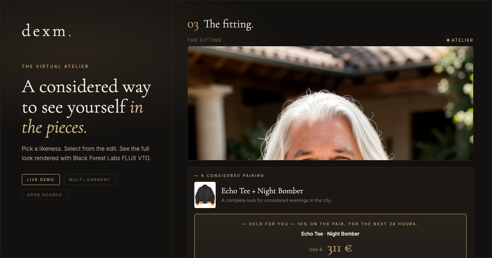

# dexm — The Virtual Atelier



An interactive virtual try-on experience built on **Black Forest Labs [FLUX VTO](https://bfl.ai)**, with optional **Runway Gen-4.5** mood animations and **FLUX.2** bag placement on the proxy.

Pick a likeness, select a piece from the edit, and see yourself in the cloth — rendered in seconds. Complete a paired look to unlock a complimentary Targus backpack preview.

**[Try the demo →](https://dealexmachina.github.io/dexm-virtual-tryon/)**

## Architecture

Two deployments from one repo:

```
docs/index.html   →  GitHub Pages   (static UI, no secrets)
proxy/server.js   →  Koyeb          (BFL + Runway proxy, holds API keys)
```

The browser never sees API keys or BFL signed URLs. The proxy owns the full pipeline: submit → poll → download → convert (WebP) → serve.

| Layer | URL |
|-------|-----|
| **Demo UI** | [dealexmachina.github.io/dexm-virtual-tryon/](https://dealexmachina.github.io/dexm-virtual-tryon/) |
| **API proxy** | `https://exuberant-octavia-dealexmachina-a8182cc0.koyeb.app` |

## What it does

- **6 preset models** — diverse ages, builds, and styles
- **12 fictional garments** — tops and outer layers as clean packshots
- **Single-garment fitting** — one click, ~8 seconds
- **Multi-garment outfits** — shirt + jacket composed server-side at BFL's 0.35 MP spec
- **Complimentary gift** — Targus backpack try-on after a complete look (combo order)
- **Outfit reveal video** — BFL keyframes chained through Runway (`mode: "reveal"`)
- **Mood animations** — 4×5s expression sequence (neutral → smile → grin → serious)
- **WebP delivery** — ~50% smaller than JPEG, negotiated via `Accept` header

## Local development

**Static UI only** (needs a running proxy):

```bash
python3 -m http.server 8092 --directory docs
```

**Full stack** (proxy + API keys):

```bash
cd proxy
npm install
BFL_API_KEY=bfl_… GEN3_API_KEY=… RUNWAY_MODEL=gen4.5 RUNWAY_RATIO=720:1280 npm start
# → http://localhost:8080
```

Set the proxy URL in the demo: `localStorage.setItem('dexm.proxyUrl', 'http://localhost:8080')` then reload.

See [`proxy/README.md`](proxy/README.md) for Koyeb deployment, env vars, and API details.

## Proxy API (summary)

| Method | Route | Purpose |
|--------|-------|---------|
| `POST` | `/models` | Generate a person image from a text prompt |
| `POST` | `/fittings` | Single-garment virtual try-on |
| `POST` | `/outfits` | Multi-garment VTO (2–4 pieces) |
| `POST` | `/accessories` | Bag/accessory on person (FLUX.2, 2-step back view for backpacks) |
| `POST` | `/animations` | Mood or outfit-reveal video → stitched MP4 |
| `GET` | `/jobs/:id` | Poll job status (image or animation) |
| `GET` | `/images/:id` | Rendered image (WebP/JPEG) |
| `GET` | `/videos/:id` | Stitched animation MP4 |
| `GET` | `/runway/balance` | Runway credit balance |
| `GET` | `/healthz` | Liveness |

## Tests

```bash
cd proxy && npm test
```

## Social preview asset

The repo hero image (`docs/assets/social-preview.jpg`) is a 1200×630 app snapshot. Re-render after UI changes:

```bash
npx playwright screenshot file://$(pwd)/docs/assets/social-preview.html \
  docs/assets/social-preview.jpg --viewport-size=1200,630
```

## Credits

**Rendering engine:** [Black Forest Labs](https://bfl.ai) — FLUX VTO for garments, FLUX.2 for accessories.

**Motion:** [Runway](https://runwayml.com) Gen-4.5 for editorial sequences.

**Hosting:** GitHub Pages (static) + [Koyeb](https://koyeb.com) (proxy).

All models and garments in this demo are AI-generated fictions. No real brand, product, or person is depicted.

## For AI coding agents

- Do **not** read image files under `results/` — JPEGs explode LLM context when decoded as vision tokens.
- Do **not** log or inspect full base64 VTO payloads (one request ≈ 100k+ tokens of opaque text).
- Use `.cursorignore` patterns: `results/`, `*.jpg`, `*.webp`.

---

MIT · an edition of 2026
